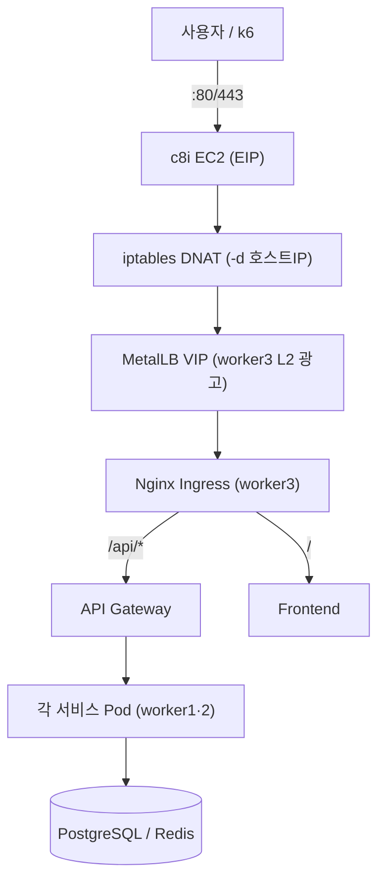

# 온프레미스 k8s vs AWS EKS — 인프라 운영 비교 실험

> 동일한 쇼핑몰 애플리케이션을 **온프레미스 Kubernetes**와 **AWS EKS**에 똑같이 배포하고,
> **"노드가 자동으로 늘어나는가"** 딱 하나만 다르게 두어, 트래픽 폭증·장애 상황에서 두 환경이 어떻게 다르게 버티는지를 데이터로 비교하는 실험.

*상태: 온프레미스 인프라·앱·배포 완료, 본실험·EKS 진행 중 · EKS 관련 항목은 "예정"으로 표기*

---

## 목차

1. [프로젝트 개요](#1-프로젝트-개요)
2. [팀 구성](#2-팀-구성)
3. [시스템 구성](#3-시스템-구성)
4. [애플리케이션](#4-애플리케이션)
5. [아키텍처](#5-아키텍처)
6. [실험 설계](#6-실험-설계)
7. [부하 측정 방법](#7-부하-측정-방법)
8. [모니터링](#8-모니터링)
9. [CI/CD · 배포](#9-cicd--배포)
10. [진행 현황](#10-진행-현황)
11. [문서 지도](#11-문서-지도)

---

## 1. 프로젝트 개요

### 목적

이커머스 타임세일처럼 트래픽이 순간 폭증하는 상황에서, **자체 보유 인프라(온프레미스)** 와 **클라우드 관리형 인프라(AWS EKS)** 의 운영 특성 차이를 정량적으로 측정한다.

- 고정 자원 환경의 **한계 지점**(몇 RPS에서 Pending 발생) 측정
- 노드 장애 시 **복구 속도(MTTR)** 비교
- 차이를 **비즈니스 임팩트**(결제 실패 = 매출 손실)로 환산

> "EKS가 좋다"를 강요하지 않는다. 운영 특성 차이를 숫자로 드러내고 판단은 보는 사람 몫. 온프레미스의 Pending은 실패가 아니라 측정 대상이다.

### 비교 프레임

| 구분 | 항목 |
|---|---|
| **같음 (공정성)** | 앱 이미지(GHCR) · k6 부하 · 데이터 · Nginx Ingress · 리소스 100m/500m · HPA 60% · DB max_conn 300 |
| **다름 ★변수** | 노드 자동확장 — 온프레: 고정 ↔ EKS: Karpenter |
| 다름 (선택) | DB 자동복구 — 온프레: 수동 ↔ EKS: RDS Multi-AZ |

---

## 2. 팀 구성

총 **5명, 2개 팀**.

| 팀 | 인원 | 담당 |
|---|---|---|
| **온프레미스 팀** | 팀원C | 앱 개발 · 온프레미스 인프라 구축 · 서비스 배포 |
| | 팀원D | 모니터링 (Prometheus / Grafana) |
| | 팀원E | 부하 테스트 · 부하 시나리오 · CI/CD (온프레·EKS 공통) |
| **EKS 팀** | 팀원A, 팀원B | EKS 환경 구축 |

---

## 3. 시스템 구성

```
AWS (ap-northeast-2)

[온프레미스 + 공통]
  c8i.2xlarge EC2 (공인IP)
    ├── 호스트 iptables DNAT (80/443 → MetalLB VIP)
    └── KVM 가상머신 4대 (virbr0 브릿지)
          ├── master   (k8s 컨트롤플레인)
          ├── worker1  (실험: gateway·product·inventory)
          ├── worker2  (실험: frontend·order·payment·user)
          └── worker3  (운영: Ingress·MetalLB·metrics, taint 격리)
  PostgreSQL EC2 — PostgreSQL 16 (Docker)
  Redis EC2      — Redis 7 (Docker)
  Monitoring EC2 — Prometheus + Grafana
  k6             — 부하 생성

[EKS — 예정]
  EKS 클러스터 (worker 2 + Karpenter) · RDS (Multi-AZ) · Redis EC2
```

| 항목 | 값 |
|---|---|
| 가상화 | KVM (중첩 가상화 활성) |
| k8s | v1.34.x, CNI Flannel v0.26.7 |
| 이미지 | GHCR `ghcr.io/incheon-soda/shoply-*` |
| 진입 | MetalLB VIP(worker3 L2 광고) + 호스트 iptables DNAT |
| DB | 온프레: EC2 PostgreSQL 16 / EKS: RDS (예정) |

---

## 4. 애플리케이션

쇼핑몰 MSA **7개 서비스** (Express/TypeScript 백엔드 + React 프론트).

| 서비스 | 포트 | 역할 |
|---|:---:|---|
| gateway | 4000 | API 진입점, 각 서비스로 프록시 + 메트릭 수집 |
| product | 4001 | 상품 조회 (Redis 캐시) |
| inventory | 4002 | 재고 관리 (`SELECT FOR UPDATE` 동시성 제어) |
| order | 4003 | 주문 생성 (재고 예약 → 저장) |
| payment | 4004 | 결제 (Mock 95% 성공) |
| user | 4005 | 로그인/인증 (bcrypt + JWT) |
| frontend | 80 | React 쇼핑몰 UI |

> 재고 동시성(`SELECT FOR UPDATE`)으로 동시 주문 폭주에도 초과판매(oversell) 방지.

---

## 5. 아키텍처

### 온프레미스 트래픽 흐름



- **iptables DNAT**: VM에 공인 IP가 없어 EC2가 80/443을 받아 넘기는 NAT 포워딩.
- **MetalLB**: ingress-nginx를 `type: LoadBalancer`로 노출 → EKS NLB와 같은 추상화(공정 비교).
- **worker3 격리**: 운영 보조 파드를 taint로 worker3에 몰아 실험 워커를 순수 고정 자원화.

> 구성도·설계·구조 통합 → `onprem/아키텍처.md`, 흐름도 → `onprem/흐름도.md`

---

## 6. 실험 설계

발표·분석 흐름: **안정(신뢰) → 스파이크(갈림) → 장애복구(임팩트)**

| 시나리오 | 상황 | 온프레미스 | EKS (예정) |
|---|---|---|---|
| **1 안정** | 200 RPS 유지 | 정상 (Error 0%) | 정상 (동일) |
| **2 스파이크 ★** | 200→1500 급증 후 유지 | Pending 지속 → 에러 지속 | 노드 추가 후 회복 |
| **3 노드 장애** | worker1 종료 | 수동 복구 (분) | 자동 복구 (~60초) |
| (4 DB 장애, 선택) | Primary DB 종료 | 수동 승격 | RDS 자동 |

> 시나리오 2의 핵심은 **"유지 구간"** — 급증은 트리거일 뿐, 차이는 부하가 유지될 때 드러난다.
> 상세 → `시나리오.md`

---

## 7. 부하 측정 방법

부하 도구는 **k6**. 부하를 계단식으로 올리며 한계를 찾는다.

- **한계의 정의 = Pending Pod이 처음 뜨는 지점** (원인이 `Insufficient cpu`여야 유효).
- **하이브리드 부하:** request를 작게(100m) → HPA 민감 발동 + k6 RPS 크게 → 실제 CPU↑.
- 매 실험 전 `load-test-prep.sql`로 재고/주문 리셋(데이터 오염 방지).
- 자동 캡처 → HTML 리포트: `scripts/capture-loop.sh` + `scripts/analyze_experiment.py`.

> 상세 → `부하테스트.md`

---

## 8. 모니터링

- **Prometheus + Grafana** (별도 EC2)에서 RPS·Error율·P95·파드 상태(Running/Pending) 관찰.
- 메트릭: 앱 prom-client(30400~30404) · kube-state-metrics(30800) · node_exporter(391xx) · cAdvisor(380xx) · postgres/redis exporter.
- 온프레는 VM이 NAT 뒤라 메트릭 포트를 iptables DNAT로 외부 노출.

> 담당: 팀원D · 상세 → `모니터링.md`

---

## 9. CI/CD · 배포

- **CI/CD:** `git push → GitHub Actions → 이미지 빌드 → GHCR 자동 푸시` (담당: 팀원E).
- **배포:** 서비스별 Deployment / Service(ClusterIP·NodePort) / HPA / ConfigMap / Secret / Ingress 매니페스트 → `kubectl apply`.
- **ConfigMap:** PostgreSQL/Redis EC2 사설 IP 등 환경값. **Secret:** DB 비번·JWT·GHCR 인증.
- 배포 검증: 로그인 토큰 발급·주문→결제 흐름·HPA 작동 확인.

---

## 10. 진행 현황

| 영역 | 상태 |
|---|---|
| 온프레미스 인프라(KVM k8s 4 VM) | 완료 |
| 앱 7개 서비스 개발·이미지 빌드 | 완료 |
| 서비스 배포·HPA 작동 확인 | 완료 |
| 모니터링(Grafana 대시보드) | 완료 |
| 본실험(한계 RPS·MTTR 정식 측정) | **진행 중** |
| EKS 환경 구축 및 비교 | **진행 중 (문서상 "예정"으로 표기)** |

### 현재까지 검증된 것

- 온프레미스 k8s 클러스터 정상 가동, 앱 7개 배포·로그인·주문·결제 정상 동작.
- 부하 시 HPA 작동으로 파드 최대 약 60개 증가 확인(단, Pending·실패 동반 — 부하 인입·파드 증가 확인 수준). 워커 CPU 80~90% 관찰.
- **미측정(본실험 예정):** 정식 한계 RPS, 노드 장애 MTTR, 스파이크 에러율, 결제 실패→매출 손실 환산.

---

## 11. 문서 지도 (폴더 구조)

문서는 **앱 / 개인(온프레미스) / 팀공통** 세 폴더로 나눠 정리한다.

### 📁 app — 애플리케이션 자체

| 문서 | 내용 |
|---|---|
| `앱_서비스_설명` | MSA 7개 서비스 구성·역할·핵심 로직·API |
| `데이터베이스` | 스키마·쿼리·동시성(SELECT FOR UPDATE)·캐시·시드 |

### 📁 onprem — 내가 한 인프라·설계·운영

| 문서 | 내용 |
|---|---|
| `온프레미스` | 온프레 구조·서비스 배치·트래픽 경로 |
| `인프라_설계` | 설계+구축 통합 (KVM 4VM·실험/운영 분리·MetalLB 진입·배포·ArgoCD 선택) |
| `아키텍처` / `아키텍처.html` | 아키텍처 통합 (설계 의도·구조도·트래픽·컴포넌트·동일화, Mermaid) |
| `사전조건서` | AWS 사전조건 — EC2·SG·이미지·DB |
| `흐름도` | 사용자 흐름 + 엔지니어 흐름 (Mermaid) |
| `AMI백업_복원` | AMI 백업 복원 |
| `트러블슈팅` | KVM 구축 트러블슈팅 |
| `내역할` | 담당 범위 상세 |

### 📁 team — 팀 차원 자료

| 문서 | 내용 |
|---|---|
| `프로젝트_역할_개요` | 전체 그림·역할 분담 |
| `기획서` | 왜 하는가 — 배경·목적·가설·비교 프레임 |
| `모니터링` | Prometheus·Grafana (팀원D) |
| `부하테스트` | k6·한계치 측정 (팀원E) |
| `시나리오` | 실험 시나리오 1/2/3(/4) |
| `설치_서버` | 모니터링·부하·DB 서버 설치 |
| `포트정리` | 전체 포트 일람 |
| `동일화` | 온프레↔EKS 항목별 동일화 대조 |
| `발표_내용` | 발표 스토리·예상질문 |
| `실험_전체계획.html` / `실험방법_설명.html` | 실험 계획·방법 |

### 📄 문서 루트

`README.md` — 전체 프로젝트 설명 (이 문서, 인덱스). 각 폴더에도 `README.md` 인덱스가 있다.

> ⚠️ EKS 관련 절은 전 문서에서 **"예정"** 으로 표기하며, 구축 후 실측값으로 채운다.
> 파일명에서 번호·접두(A~D)를 제거하고 세 폴더로 정리했으며, 문서 간 링크도 새 구조에 맞게 수정됨.
