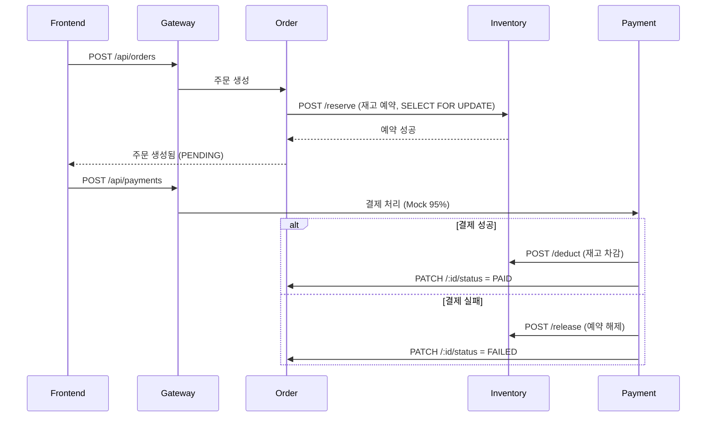

# 00. 앱(서비스) 설명 — Shoply MSA 7개 서비스

> 쇼핑몰 애플리케이션 자체에 대한 설명. 서비스 구성·역할·핵심 로직·API·서비스 간 통신을 다룬다.
> 데이터 계층(스키마·쿼리·동시성·캐시)은 같은 폴더의 `데이터베이스.md` 참고.

---

## 1. 개요

Shoply는 신발 쇼핑몰을 **마이크로서비스(MSA) 7개**로 구성한 애플리케이션이다.

| 구분 | 스택 |
|---|---|
| 백엔드 (6개) | Node.js · Express · TypeScript |
| 프론트엔드 | React |
| 데이터 | PostgreSQL 16 (서비스별 테이블 소유) + Redis 7 (Product 캐시) |
| 이미지 | 서비스별 Dockerfile → GitHub Actions → GHCR `ghcr.io/ktk026/shoply-*` |

> 모든 외부 요청은 **gateway**를 단일 진입점으로 통과하며, gateway가 각 마이크로서비스로 프록시한다.

---

## 2. 서비스 구성

| 서비스 | 포트 | 소유 테이블 | 핵심 역할 |
|---|:---:|---|---|
| **gateway** | 4000 | — | 모든 API 진입점. 각 서비스로 프록시 + Prometheus 메트릭 수집 |
| **product** | 4001 | `products` | 상품 목록/상세 조회 (Redis 캐시), 타임세일 제어 |
| **inventory** | 4002 | `inventory` | 재고 예약/차감/해제. **`SELECT FOR UPDATE` 동시성 제어** |
| **order** | 4003 | `orders`, `order_items` | 주문 생성 (재고 예약 → 주문 저장, 트랜잭션) |
| **payment** | 4004 | `payments` | 결제 처리 (Mock 95% 성공). 성공 시 재고 차감, 실패 시 예약 해제 |
| **user** | 4005 | `users` | 회원가입·로그인 (bcrypt + JWT) |
| **frontend** | 80 | — | React 쇼핑몰 UI (상품/주문/결제/어드민) |

---

## 3. 서비스별 상세

### gateway (:4000)

- 모든 `/api/*` 요청의 단일 진입점. 경로에 따라 각 마이크로서비스로 프록시.
- Prometheus `prom-client`로 요청 메트릭(RPS·지연·상태코드)을 수집해 `/metrics`로 노출.

| 라우팅 | 도착 서비스 |
|---|---|
| `/api/products`, `/api/products/timesale/*` | product |
| `/api/inventory` | inventory |
| `/api/orders` | order |
| `/api/payments` | payment |
| `/api/auth` | user |

### product (:4001)

- 상품 목록/상세 조회. **Redis 캐시**(목록 60초 / 상세 30초)로 DB 부하 감소.
- 가용 재고(`quantity - reserved`)를 집계해 품절/재고부족/재고있음 상태 표시.
- **타임세일 제어:** 무작위 N개 상품에 할인율·종료시각 적용(시작), 일괄 해제(종료). 변경 시 관련 캐시 즉시 무효화.
- ⚠️ **재고(inventory)는 절대 캐시하지 않음** — 캐시하면 실제 재고와 어긋나 실험이 오염됨.

### inventory (:4002) — 핵심 병목

- 재고 예약(`reserve`) → 결제 성공 시 실차감(`deduct`) / 실패 시 예약 해제(`release`).
- **`SELECT FOR UPDATE`로 행 잠금** → 동시 주문을 직렬화해 **초과판매(oversell) 방지**.
- 타임세일 동시 주문 폭주 시 락 대기가 누적되며, 이 지점이 부하 실험의 핵심 병목이 된다.

### order (:4003)

- 주문 생성: inventory에 재고 예약 요청 → 성공 시 `orders` + `order_items` 저장(트랜잭션).
- 주문 시점의 상품명·단가를 `order_items`에 **스냅샷**으로 저장(이후 상품 정보 변경과 무관).
- 상태 전이: `PENDING → PAID` 또는 `PENDING → FAILED`.

### payment (:4004)

- 결제 처리(**Mock, 95% 성공**). 결과에 따라 inventory·order를 후속 호출.
  - 성공 → inventory `deduct`(재고 차감) + order 상태 `PAID`.
  - 실패 → inventory `release`(예약 해제) + order 상태 `FAILED`.
- 실시간 결제 통계(성공/실패/최근 15건)를 Redis 3초 TTL 캐시로 제공.
- 실패 사유: `PAYMENT_GATEWAY_ERROR` / `INSUFFICIENT_STOCK` / `INVENTORY_DEDUCT_FAILED`.

### user (:4005)

- 회원가입·로그인. 비밀번호는 **bcrypt(cost=10) 해시**로 저장(평문 금지).
- 로그인 성공 시 **JWT** 발급 → 이후 요청 인증.
- 시드 계정: `admin@shoply.com`(Admin1234!) + `test1~2000`(Test1234!).

### frontend (:80)

- React 쇼핑몰 UI. 상품 목록/상세, 주문, 결제, 어드민(타임세일 제어) 페이지.
- 정적 자원은 Nginx로 서빙. HPA 없이 정적 배치.

---

## 4. 핵심 비즈니스 흐름 — 주문→결제



> 핵심: **재고 예약은 주문 시점, 실차감은 결제 성공 시.** 결제 실패하면 예약을 즉시 해제해 재고를 되돌린다.

---

## 5. 동시성 — 초과판매 방지

타임세일에 수백 명이 동일 상품·사이즈에 동시 주문하면, "재고 확인 → 차감" 사이에 다른 트랜잭션이 끼어들어 초과판매가 발생할 수 있다. inventory는 `SELECT ... FOR UPDATE`로 해당 행에 배타적 락을 걸어 동시 주문을 직렬화한다.

```sql
BEGIN;
SELECT quantity, reserved FROM inventory
WHERE product_id = $1 AND size = $2
FOR UPDATE;            -- 행 잠금 (다른 트랜잭션 대기)
-- available 검증 후
UPDATE inventory SET reserved = reserved + $3
WHERE product_id = $1 AND size = $2;
COMMIT;               -- 락 해제 → 다음 트랜잭션 진행
```

> 상세 쿼리·캐시 키·인덱스 전략 → `데이터베이스.md`

---

## 6. 빌드 · 이미지

- 서비스별 Dockerfile (TypeScript 빌드 → Node 실행).
- `git push → GitHub Actions → 이미지 빌드 → GHCR 자동 푸시`.
- 빌드 검증: `docker compose build` 전체 통과 확인.

> 로컬 검증·DB 구축은 `데이터베이스.md`의 Docker Compose 절 참고.
