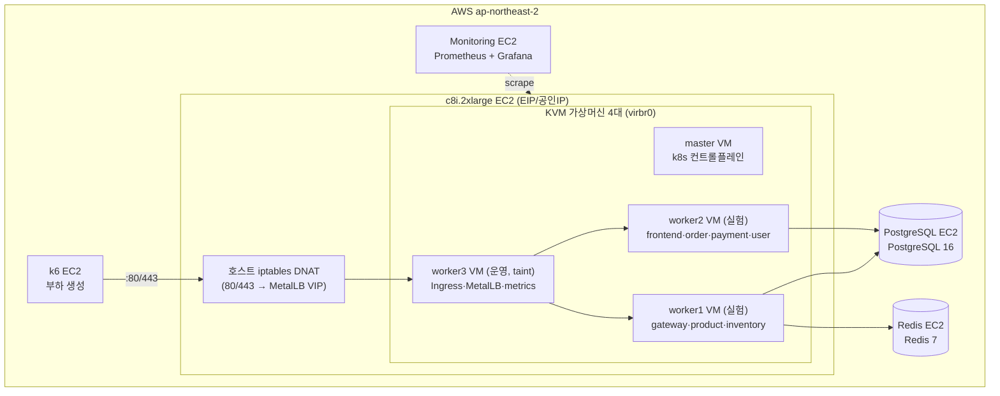
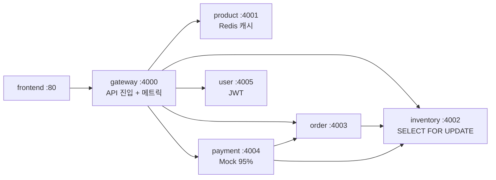
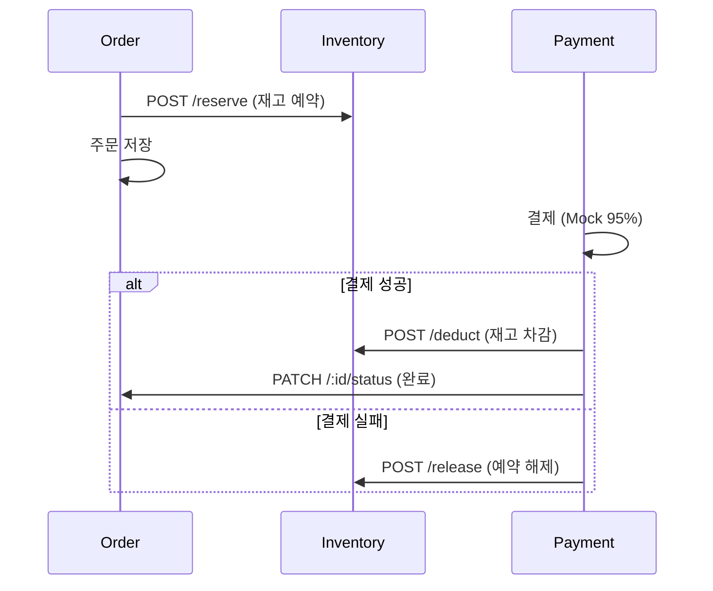
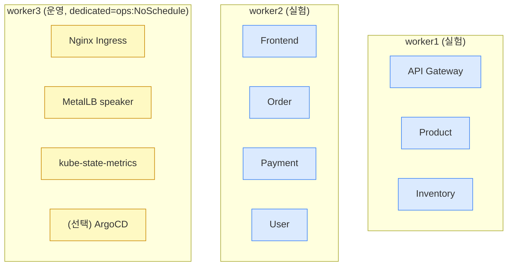

# 아키텍처 — 온프레미스 vs EKS

> 설계 의도·컴포넌트 역할·구조도·트래픽 흐름·동일화를 한 문서로 통합. (그림은 Mermaid + ASCII, 한 장 요약은 `아키텍처.html`)

---

## 1. 설계 목표

1. **공정한 비교** — "노드 자동확장" 하나만 변수로 두고 나머지 경로를 양쪽 동일하게.
2. **측정 신뢰도** — 실험 워커를 "순수 고정 자원"으로 만들어 운영 오버헤드가 측정을 오염시키지 않게.
3. **재현성** — 같은 입력이면 같은 결과가 나오도록 설치·측정 절차를 고정.

---

## 2. 전체 인프라 구성 (온프레미스)



| 구성 | 값 |
|---|---|
| 가상화 | KVM (중첩 가상화 활성) |
| k8s | v1.34.x, CNI Flannel v0.26.7 |
| 이미지 | GHCR `ghcr.io/ktk026/shoply-*` |
| 진입 | MetalLB VIP(worker3 L2 광고) + 호스트 iptables DNAT |

---

## 3. 애플리케이션 구조 — MSA 7개



### 서비스 간 통신 (재고 정합성)



> Inventory가 `SELECT FOR UPDATE`로 행을 잠가 동시 주문을 직렬화 → 초과판매(oversell) 방지.

---

## 4. 노드 배치 설계 — 실험/운영 분리



- 초기 배치는 **soft nodeAffinity**(`experiment-role` 라벨), HPA 추가분은 자유 배치.
- worker3에 **taint**를 걸어 앱 파드는 못 들어오고 운영 컴포넌트만 toleration으로 진입 → 실험 워커 2대가 "순수 고정 자원".
- 시나리오 3에서 **worker1 종료** → 모든 파드가 worker2로 몰려 자원 부족 → Pending.

---

## 5. 트래픽 흐름

### 온프레미스

```
사용자/k6 → EIP(c8i EC2) :80/443
  → 호스트 iptables DNAT (-d 호스트IP)         ← VM에 공인IP 없음
  → MetalLB VIP 192.168.122.24x (worker3 L2 광고)
  → Nginx Ingress Pod (worker3)
      ├── /api/* → API Gateway :4000 → 각 마이크로서비스
      └── /      → Frontend :80
  → PostgreSQL / Redis (별도 EC2)
```

### EKS (예정)

```
사용자/k6 → NLB (AWS 관리형, ingress-nginx type=LoadBalancer 자동 생성)
  → Nginx Ingress Pod (온프레와 완전 동일)
      ├── /api → API Gateway
      └── /    → Frontend
  → RDS PostgreSQL · Redis
```

> 진입 LB(온프레 MetalLB VIP ↔ EKS NLB)만 구현이 다를 뿐 둘 다 `LoadBalancer` 추상화로 대칭. Nginx Ingress부터 백엔드까지 완전 동일.

---

## 6. 컴포넌트 역할

| 컴포넌트 | 역할 | 설계 이유 |
|---|---|---|
| 호스트 iptables DNAT | EIP 80/443을 MetalLB VIP로 넘기는 NAT 포워딩 | VM에 공인IP 없음. 홉 1개 추가는 변화율(%) 비교로 보정 |
| MetalLB | ingress-nginx를 `LoadBalancer`로 노출, VIP를 worker3가 L2 광고 | **EKS NLB와 같은 추상화**(공정 비교) |
| Nginx Ingress (worker3) | L7 경로 라우팅 `/api`→Gateway, `/`→Frontend | EKS와 동일 파일 공유 |
| API Gateway | 마이크로서비스 분배 + 메트릭 수집 | 단일 진입점 |
| 각 서비스 Pod | 비즈니스 로직 (ClusterIP) | — |

---

## 7. 온프레 vs EKS 차이 (동일화 관점)

| 구간 | 온프레미스 | EKS | 비고 |
|---|---|---|---|
| 진입 | EIP→iptables DNAT→**MetalLB VIP**→ingress | **NLB**→ingress | 대칭(`LoadBalancer`) |
| Ingress~서비스 | Nginx Ingress NodePort 30080 | 동일 | ✅ 완전 동일 |
| 실험 노드 | KVM VM worker1·2 **고정** + worker3 운영격리 | EC2 노드 + **Karpenter 자동확장** | ★ 변수 |
| DB | EC2 PostgreSQL (수동복구) | RDS Multi-AZ (자동복구) | 선택 변수 |
| CNI | Flannel | AWS VPC CNI | 환경 표준(측정 안 함) |

> 실제 차이는 **노드 자동확장(★)·DB 복구**뿐. 나머지는 동일 → "노드 탄력성"만 순수 비교.

---

## 8. 포트 구조 (요약)

| 포트 | 용도 |
|---|---|
| 80/443 | MetalLB 진입 (호스트 DNAT → ingress VIP) |
| 30080 | Nginx Ingress NodePort |
| 4000~4005 | 앱 서비스 컨테이너 |
| 30400~30404 / 30800 | 앱 메트릭 / kube-state-metrics |
| 39101~39103 / 38080~38081 | node_exporter / cAdvisor |
| 5432 / 6379 | PostgreSQL / Redis |
| 9090 / 3000 | Prometheus / Grafana |

> 전체 포트 일람은 `../team/포트정리.md`.
