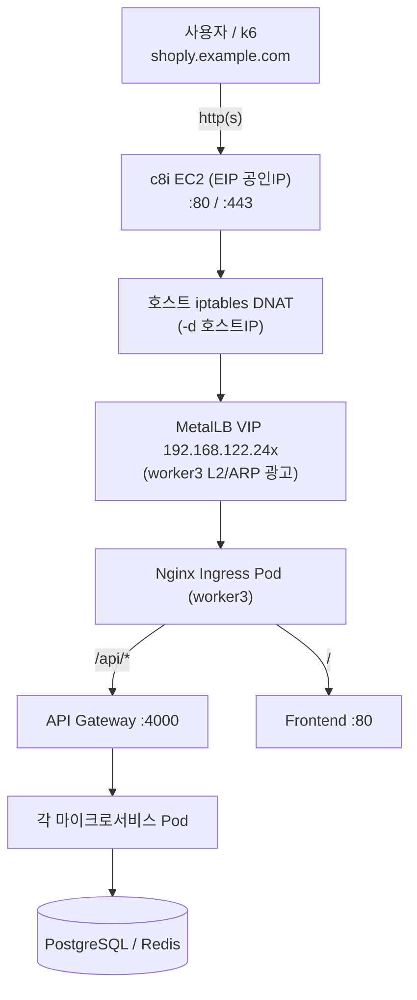
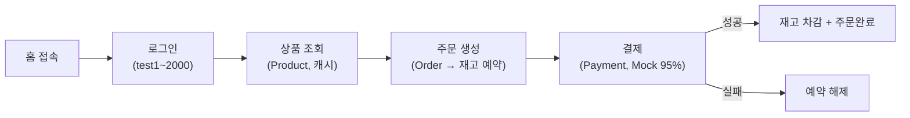
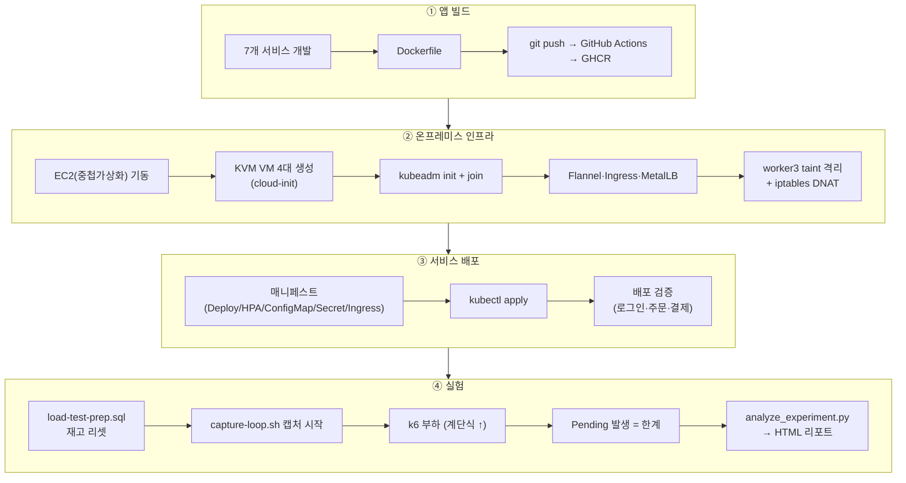
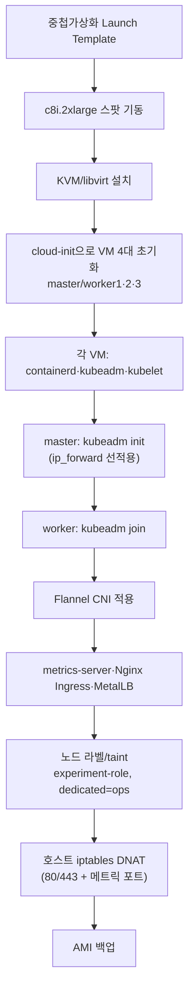
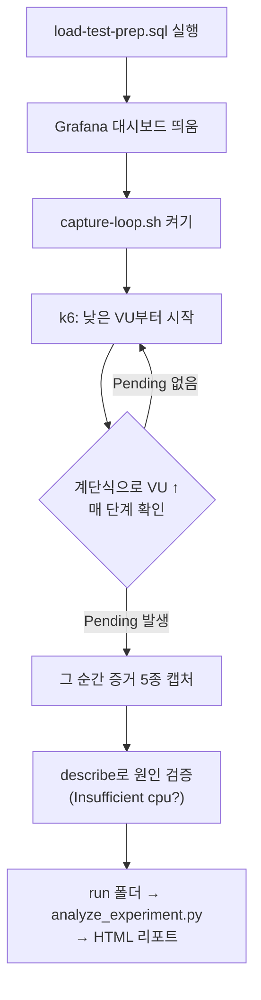
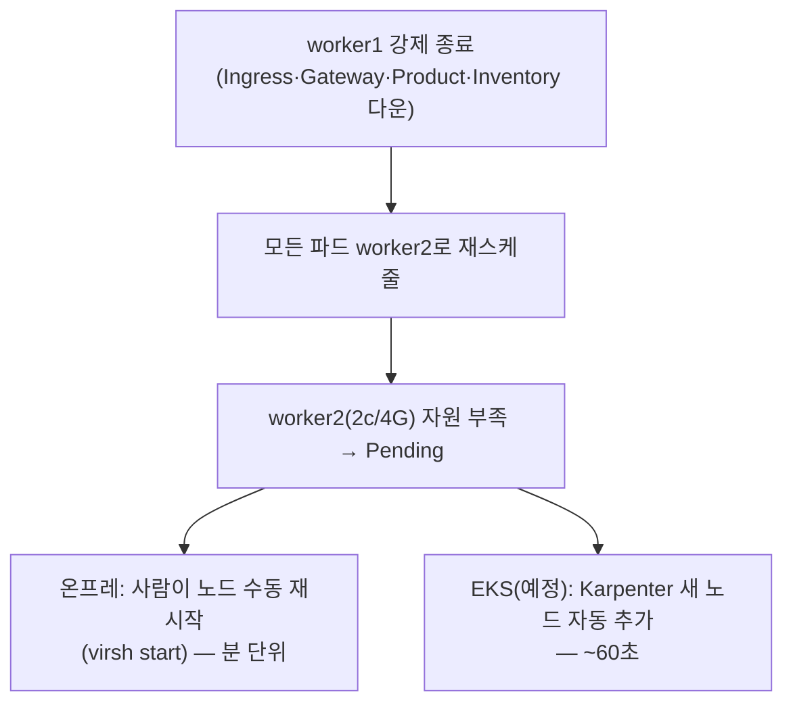

# D. 흐름도

> 두 가지 관점의 흐름을 다룬다.
> **사용자 흐름** = 쇼핑몰 이용자가 요청을 보낼 때 트래픽이 흐르는 경로.
> **엔지니어 흐름** = 구축·배포·실험을 수행하는 작업 순서.

---

## 1. 사용자 흐름 (트래픽 경로)

### 1.1 요청 진입 경로 (온프레미스)

> KVM VM에 공인 IP가 없어 EC2가 80/443을 받아 MetalLB VIP로 넘기는 **NAT 포워딩 홉**이 한 번 더 있다(EKS엔 없음 → 변화율%로 보정).

### 1.2 사용자 시나리오 흐름 (쇼핑 플로우)

### 1.3 요청 라우팅 규칙

| 경로 | 도착 |
|---|---|
| `/` | Frontend |
| `/api/products` | Product |
| `/api/inventory` | Inventory |
| `/api/orders` | Order |
| `/api/payments` | Payment |
| `/api/auth` | User |

---

## 2. 엔지니어 흐름 (구축 → 배포 → 실험)

### 2.1 전체 작업 흐름

### 2.2 인프라 구축 상세 흐름

### 2.3 실험 측정 흐름 (한계 RPS 찾기)

| 한계 신호 | 확인 |
|---|---|
| **Pending 발생** ★ | `kubectl get pods --field-selector=status.phase=Pending` |
| 워커 CPU 90%+ | `kubectl top nodes` |
| HPA CURRENT=MAX | `kubectl get hpa` |

> **한계의 정의 = Pending Pod이 처음 뜨는 지점.** 원인이 `Insufficient cpu`여야 "고정 자원 한계"로 유효.

### 2.4 시나리오 진행 흐름

---

## 3. 장애·복구 흐름 (시나리오 3)

> 복구 시간(MTTR) = 비즈니스 손실. 장애 중 결제 실패 건수를 매출 손실로 환산한다.
